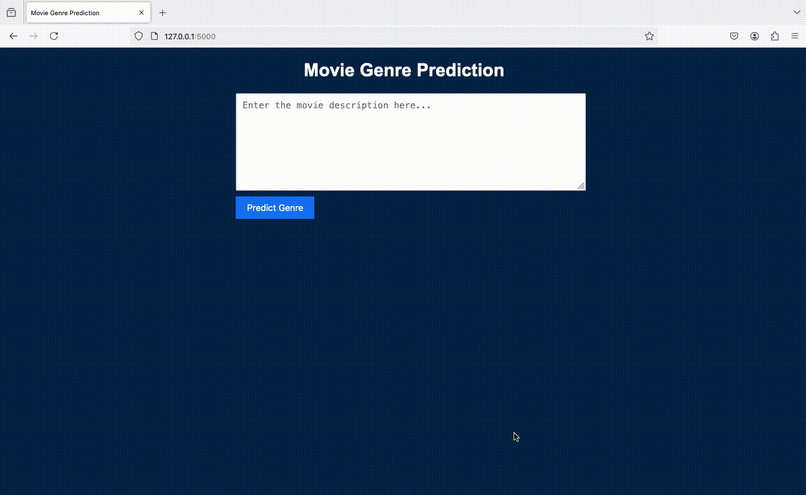

# CodSoft Internship Projects
<!-- About The Project -->
Welcome to the repository for my internship projects completed at CodSoft! This repository contains four distinct projects, each focusing on a different machine learning application. Below is a brief overview of each project along with instructions on how to set up, run, and use the provided code.

<!-- TABLE OF CONTENTS -->

Table of Contents

<ol>
  <li><a href="#movie-genre-classification">Movie Genre Classification</a></li>
  <li><a href="#credit-card-fraud-detection">Credit Card Fraud Detection</a></li>
  <li><a href="#customer-churn-prediction">Customer Churn Prediction</a></li>
  <li><a href="#spam-sms-detection">Spam SMS Detection</a></li>
 
  <li><a href="#dataset">Dataset</a></li>
  <ul>
      <li><a href="#movie-genre-classification-dataset">Movie Genre Classification Dataset</a></li>
      <li><a href="#credit-card-fraud-detection-dataset">Credit Card Fraud Detection Dataset</a></li>
      <li><a href="bank-customer-churn-prediction-dataset">Bank Customer Churn Prediction Dataset</a></li>
      <li><a href="sms-spam-collection-dataset">SMS Spam Collection Dataset</a></li>     
    </ul>
     </li>
</ol>

# Author: Lilian Ngonadi

# Movie Genre Classification
Objective:
Build a machine learning model to predict movie genres based on plot summaries.

Key Features:
- Data preprocessing: Tokenization, lowercasing, stopword removal.
- Model training with Naive Bayes, Logistic Regression, and Support Vector Classifier (SVC).
- Evaluation of models using metrics such as accuracy, precision, and recall.

Technologies:
Python, Scikit-learn, NLTK, Pandas, Flask (for web app).

Files:
- movie_genre_classification.ipynb: Jupyter Notebook containing the full project code.
- main.py: Flask backend for the web application.
- index.html: HTML template for user interaction

# Credit Card Fraud Detection
Objective:
Develop a machine learning model to detect fraudulent credit card transactions.

Key Features:

- Data preprocessing: Categorical encoding, feature scaling, and handling imbalanced data using SMOTE.
- Model training with Logistic Regression, Decision Trees, and Random Forests.
- Evaluation of models using accuracy, precision, recall, and ROC-AUC curves.

Technologies:
Python, Scikit-learn, Pandas, Imbalanced-learn.

Files:
- credit_card_fraud_detection.ipynb: Jupyter Notebook containing the full project code.
- fraud_detection.py: Script for model training and evaluation.

# Customer Churn Prediction

Objective:
Create a machine learning model to predict customer churn based on historical customer data.

Key Features:

- Data preprocessing: Encoding categorical variables, feature scaling, and addressing class imbalance.
- Model training with Logistic Regression, Random Forests, and Gradient Boosting.
- Evaluation of models using accuracy, precision, recall, and ROC-AUC.

Technologies:
Python, Scikit-learn, Pandas.

Files:

- customer_churn_prediction.ipynb: Jupyter Notebook containing the full project code.
- churn_model.py: Script for model training and evaluation.

# Spam SMS Detection

Objective:
Build an AI model to classify SMS messages as spam or legitimate.

Key Features:

- Text preprocessing: Tokenization, stopword removal, and lemmatization.
- Model training with Naive Bayes, Logistic Regression, and Support Vector Machines (SVM).
- Evaluation of models using precision, recall, F1-score, and accuracy.

Technologies:
Python, Scikit-learn, NLTK, Pandas.

Files:

- spam_sms_detection.ipynb: Jupyter Notebook containing the full project code.
- sms_spam_detector.py: Script for model training and evaluation.
- 

# Dataset

## Movie Genre Classification Dataset

Dataset Link: [Movie Genre Classification Dataset:](https://www.kaggle.com/datasets/hijest/genre-classification-dataset-imdb)

Description:

This dataset contains a collection of movie titles, plot summaries, and genres, sourced from IMDb. It includes over 50,000 entries, covering a diverse range of genres. The dataset was instrumental in training a machine learning model to predict movie genres based on plot summaries.

Key Features:

- Title: The name of the movie.
- Description: A brief plot summary of the movie.
- Genre: The genre(s) associated with the movie, used as the target variable.

Use Case: The dataset was used in the Movie Genre Classification project, where I developed a model that can classify movies into genres based on their plot summaries. Text preprocessing techniques like tokenization, stopword removal, and vectorization were crucial in preparing the data for model training.

## Credit Card Fraud Detection Dataset

Dataset Link: [Fraud Detection Dataset:](https://www.kaggle.com/datasets/kartik2112/fraud-detection)

Description:

This dataset comprises credit card transaction data labeled as fraudulent or legitimate. It contains features such as transaction amounts, merchant details, and geographical data. The dataset is highly imbalanced, with fraudulent transactions being a small minority.

Key Features:

- Transaction Time: The time at which the transaction occurred.
- Amount: The amount of the transaction.
- Merchant: The merchant where the transaction took place.
- Category: The category of the merchant.
- Fraud Label: A binary label indicating whether the transaction was fraudulent (1) or legitimate (0).

Use Case: In the Credit Card Fraud Detection project, this dataset was used to build a model that detects fraudulent transactions. The project involved tackling the class imbalance through techniques like SMOTE and selecting an appropriate machine learning model to maximize detection accuracy.

## Bank Customer Churn Prediction Dataset

Dataset Link: [Bank Customer Churn Prediction Dataset:](https://www.kaggle.com/datasets/shantanudhakadd/bank-customer-churn-prediction)

Description:

This dataset includes information about bank customers, such as their demographics, account balances, and transaction history. The goal was to predict whether a customer would churn (i.e., leave the bank).

Key Features:
- CreditScore: The credit score of the customer.
- Geography: The customer's geographical location.
- Gender: The gender of the customer.
- Age: The age of the customer.
- Balance: The account balance.
- Exited: A binary label indicating whether the customer has churned (1) or not (0).

Use Case: This dataset was used in the Customer Churn Prediction project. I applied machine learning models like Random Forests and Gradient Boosting to predict customer churn, using various preprocessing techniques such as encoding categorical variables and balancing the dataset.

## SMS Spam Collection Dataset

Dataset Link:  [SMS Spam Collection Dataset:](https://www.kaggle.com/datasets/uciml/sms-spam-collection-dataset)

Description:

This dataset consists of SMS messages labeled as either spam or legitimate. It contains 5,572 messages, making it an excellent dataset for text classification tasks.

Key Features:

- Message: The text of the SMS message.
- Label: The label indicating whether the message is spam (1) or legitimate (0).

Use Case: In the Spam SMS Detection project, this dataset was used to develop a model that classifies SMS messages as spam or legitimate. The project involved extensive text preprocessing, including tokenization, stopword removal, and lemmatization, and the application of various machine learning algorithms.
